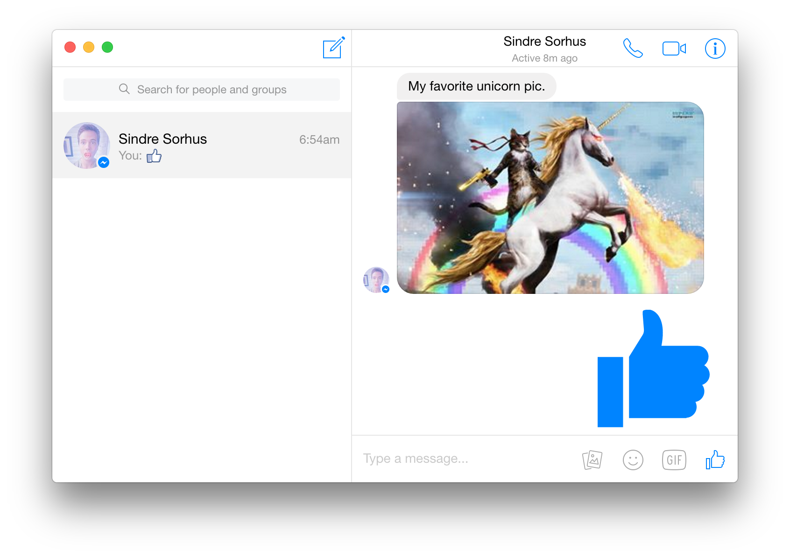

# Farma Mobile Dashboard

> Official Farma Mobile dashboard app

<br>
[](https://github.com/farma-mobile/farma-mobile-dashboard-native/releases/latest)

*OS X 10.9+, Windows 7+ & Linux are supported.*

## Install

### OS X

[**Download**](https://github.com/farma-mobile/farma-mobile-dashboard-native/releases/latest), unzip, and move `Farma Mobile.app` to the `/Applications` directory.

### Linux

[**Download**](https://github.com/farma-mobile/farma-mobile-dashboard-native/releases/latest) and unzip to some location.

To add a shortcut to the app, create a file in `~/.local/share/applications` called `farma-mobile.desktop` with the following contents:

```
[Desktop Entry]
Name=Farma Mobile
Exec=/full/path/to/folder/Farma\ Mobile
Terminal=false
Type=Application
Icon=/full/path/to/folder/Farma\ Mobile/resources/app/media/Icon.png
```

### Windows

[**Download**](https://github.com/farma-mobile/farma-mobile-dashboard-native/releases/latest) and unzip to some location.


## Dev

Built with [Electron](http://electron.atom.io).

###### Commands

- Init: `$ npm install`
- Run: `$ npm start`
- Build OS X: `$ npm run build-osx`
- Build Linux: `$ npm run build-linux`
- Build Windows: `$ npm run build-windows`
- Build all: `$ brew install wine` and `$ npm run build` *(OS X only)*


## License

MIT © [Dhyego Fernando](http://github.com/dhyegofernando)
